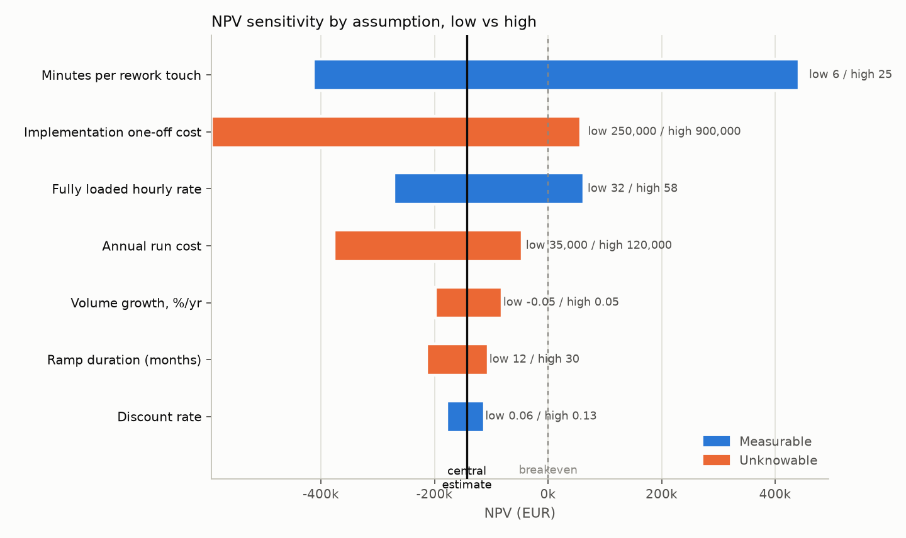
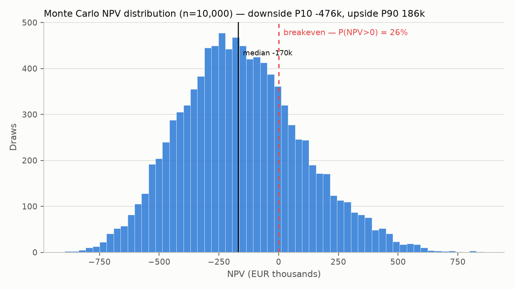
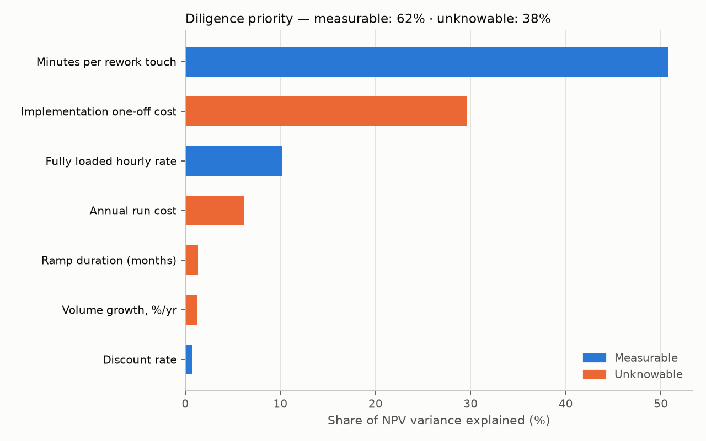

# GBS Business Case

A purchase-to-pay improvement case whose baseline is **measured, not assumed**.

Most shared-services business cases rest on numbers estimated in a workshop:
current automation rate, rework share, handling times. This one takes its
baseline from 1.6M SAP events analysed in
[p2p-process-mining](https://github.com/morichtereur/p2p-process-mining), and
keeps measured facts and judgement calls in separate files so a reader can
always tell which half of a result is evidence.

## The separation

| | |
|---|---|
| `baseline.json` | Only what the event log shows. Generated by `src/baseline.py`, committed so the repo reproduces itself without the 695 MB log. |
| `assumptions.yaml` | Only what it cannot. Every entry carries a source and a range. |

Nothing measured goes in the second file; nothing assumed goes in the first.

## Measured baseline

From 251,734 purchase order line items, 183,677 of which reach `Clear Invoice`:

| | |
|---|---|
| Straight-through rate | **63.2%** of completed cases |
| Median cycle time, touchless | 71.3 days |
| Median cycle time, with rework | 90.9 days |
| Rework penalty | **19.7 days** |

### The target is demonstrated, not asserted

Case-weighted top quartile across the 14 segments with a reliable rate:
**70.5%**. That figure is not a statistical artefact — it is the rate **Sales
actually runs at, on 55,621 completed cases**. A target already being hit at
scale inside the same organisation, on the same system and process, is a
different kind of claim from an external benchmark.

An earlier version took the best-performing segment outright, which selected
Marketing at 78.2% — on 0.7% of volume. Small segments score well because they
carry simpler orders, not better discipline, and sizing 76,643 Packaging cases
against them would have inflated the case. Weighting by case count removes that.

### Where the opportunity sits

| Spend area | Complete cases | STP | Gap to 70.5% |
|---|---|---|---|
| Packaging | 76,643 | 59.7% | −10.8pp |
| Sales | 55,621 | 70.5% | at target |
| Trading & End Products | 17,026 | 60.0% | −10.5pp |
| Additives | 12,381 | 65.1% | −5.4pp |
| Latex & Monomers | 3,080 | 44.2% | −26.3pp |

Packaging is the case: largest volume, materially below a rate its own
organisation already achieves.

### What is excluded, and why

- **Consignment** — 14,498 cases, **zero** completions. Not a poor performer,
  an unmeasurable one. No saving is claimed on it.
- **Seven segments below 500 completed cases** — rates too thin to size against.
- **Working capital** — the log carries cumulative net worth per event, not
  invoice values usable for a payment-timing calculation. Named as a benefit,
  left unquantified.

## Rework drivers

Ranked by cycle-time penalty, the worst offenders are rare: `SRM: Transfer
Failed` adds 233 days across 42 cases. The one that matters commercially is
`Cancel Invoice Receipt` — **+57 days across 5,909 cases**. Volume times
penalty, not penalty alone, is what a business case should chase.

## Setup

    python3 -m venv .venv
    .venv/bin/pip install -r requirements.txt
    .venv/bin/python src/baseline.py --p2p-output ../p2p-process-mining/output
    .venv/bin/python src/model.py
    .venv/bin/python src/sensitivity.py
    .venv/bin/python src/report.py

## Status

- [x] `src/baseline.py` — measured baseline with provenance
- [x] `assumptions.yaml` — assumptions, sourced and ranged
- [x] `src/model.py` — opportunity sizing, cash flows, NPV and payback
- [x] `src/sensitivity.py` — tornado, Monte Carlo, diligence priority
- [x] `src/report.py` — charts and written case

## The standard it had to meet

The target was a case that survives a partner review. That is not more
numbers; it is honest treatment of uncertainty. Three things followed from it.

**1. Measure `touches_per_rework_case` before modelling anything.**
It sat in `assumptions.yaml` as an explicit `null` so the model would fail
loudly rather than quietly guess. It was derivable: count events per case
whose activity is in `REWORK_ACTIVITIES` — the list lives in
`p2p-process-mining/src/touchless.py` and is the same definition the 63.2% STP
rate rests on, so reusing it kept the two consistent.
`p2p-process-mining/src/rework_touches.py`
now measures it — mean **1.48** touches per reworked case, median 1 — and it
lives in `baseline.json`'s `rework_touches` block, not in the assumptions
file. Effort per touch stayed an assumption; the *number* of touches did not.

**2. Report a distribution, not a point.**
`src/sensitivity.py` runs a 10,000-draw Monte Carlo over the assumption
ranges in `assumptions.yaml`, reporting the probability of clearing the
hurdle rate plus an explicit downside (P10) case, and a tornado chart showing
which single assumption moves the answer most.

**3. The distinguishing output: diligence priority.**
The variance in NPV is decomposed by source and split into two buckets, each
assumption in `assumptions.yaml` tagged `diligence_bucket: measurable` or
`unknowable` — things that *could* be measured but were not (handling times,
touch counts by segment) versus things that genuinely cannot be known yet
(implementation cost, ramp). The first bucket is a work plan: it says which
week of diligence buys the most confidence.

## Result

The expectation going in was that the tornado would be dominated by
`implementation.one_off_cost_eur` rather than by anything measured. It is
not. **62% of NPV variance sits in the measurable bucket** —
`effort.minutes_per_rework_touch` alone accounts for half of it — because the
benefit stream is a 5-year discounted annuity: a proportional swing in
effort-per-touch compounds across every year of benefit, while the
implementation cost is a single year-zero number. A wide low/high band does
not automatically make a number the biggest driver of NPV variance once
discounting is applied, and the model said so instead of confirming the
prior.

The headline itself is not the one a workshop estimate would have produced:
at central assumptions the case does **not** clear the 9% hurdle rate
(NPV **–€142,931**), and Monte Carlo puts the odds of a positive NPV at
**26%**. That is a direct consequence of the measured touches-per-case figure
— reworked cases average 1.48 touches, not the multi-touch slog usually
assumed, so eliminating rework saves less labour than intuition suggests.

The useful output is not that number alone but where it points: diligence
should spend its first week on a rework-handling time study and the client's
actual rate card, not on chasing an implementation cost quote.

Full write-up and cash-flow table:
[`output/business_case.md`](output/business_case.md) — regenerate with
`.venv/bin/python src/report.py` after any change to `baseline.json` or
`assumptions.yaml` (the charts above are written to `assets/`, tracked in
git so they render here without a local run).

---

Built by [Moritz Richter](https://www.linkedin.com/in/moritz-richter-28297119a/) · Finance & Strategy Consultant · Zürich
